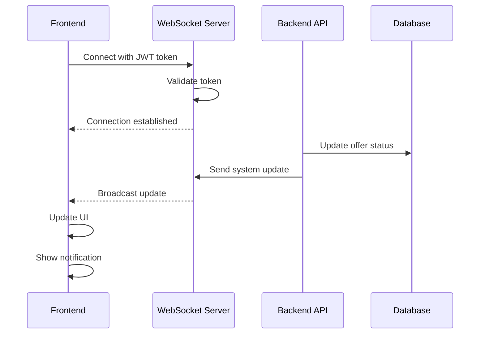
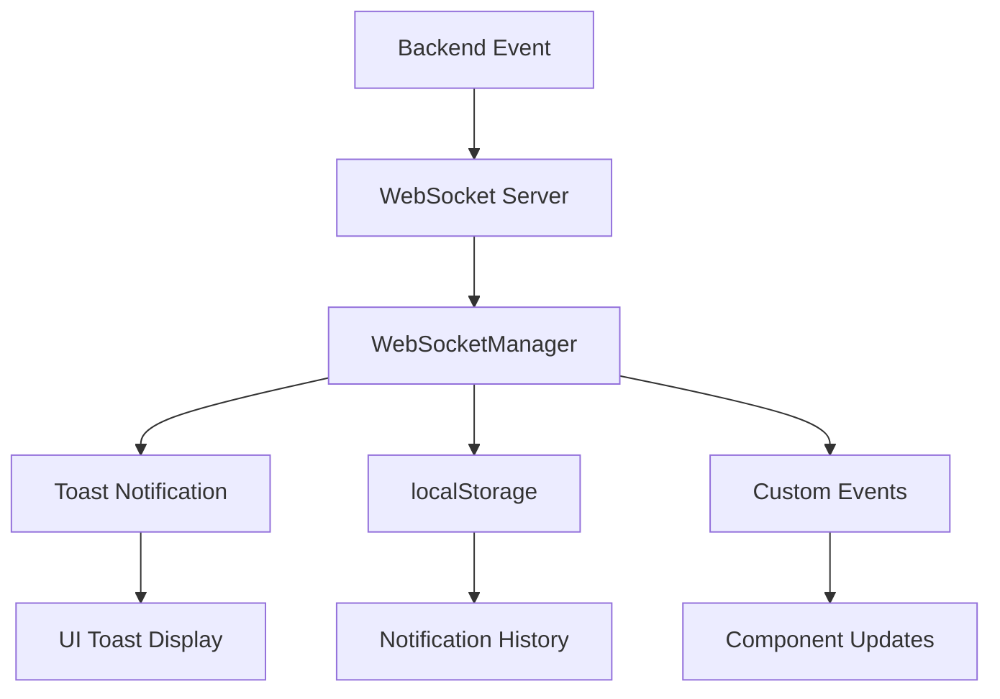

# 🏗️ AdLinkPro Infrastructure Integration Guide

## 📋 Overview
This document describes the comprehensive infrastructure integration system implemented for AdLinkPro, ensuring end-to-end connectivity between all platform components.

---

## 🔧 Core Infrastructure Components

### 🌐 WebSocket Integration System

#### Enhanced WebSocketManager
The `WebSocketManager` component provides comprehensive real-time communication capabilities:

```tsx
import { WebSocketManager } from '@/components/WebSocketManager';

// Usage in App.tsx
function App() {
  return (
    <AuthProvider>
      <ThemeProvider>
        <LanguageProvider>
          <WebSocketManager />
          {/* Your app components */}
        </LanguageProvider>
      </ThemeProvider>
    </AuthProvider>
  );
}
```

**Features:**
- **Automatic Reconnection**: Handles connection drops with exponential backoff
- **Authentication Integration**: Automatically includes JWT token and user info
- **Notification System**: Processes real-time notifications with toast display
- **System Updates**: Handles real-time data synchronization
- **Error Handling**: Comprehensive error management and logging
- **Heartbeat Monitoring**: Maintains connection health with ping/pong

#### WebSocket Message Types
```typescript
interface WebSocketMessage {
  type: 'notification' | 'system_update' | 'ping' | 'pong' | 'auth_required';
  data: any;
  timestamp: string;
}

// Notification message
{
  type: 'notification',
  data: {
    id: 'notif-123',
    title: 'New Offer Available',
    message: 'Finance offer #456 is now available for promotion',
    type: 'info',
    action: { label: 'View Offer', url: '/dashboard/partner/offers/456' }
  },
  timestamp: '2023-12-25T12:00:00Z'
}

// System update message
{
  type: 'system_update',
  data: {
    entity: 'offer',
    action: 'approved',
    entityId: 'offer-456',
    data: { offerId: '456', status: 'approved' }
  },
  timestamp: '2023-12-25T12:00:00Z'
}
```

### 🎨 Theme Integration System

#### Theme Context Enhancement
The theme system provides comprehensive dark/light mode support:

```typescript
// Theme configuration
interface ThemeConfig {
  theme: 'light' | 'dark' | 'system';
  systemPreference: 'light' | 'dark';
  customColors?: Record<string, string>;
}

// Usage
const { theme, setTheme, toggleTheme } = useTheme();
```

**Features:**
- **System Theme Detection**: Automatically detects OS preference
- **Persistent Storage**: Saves theme preference to localStorage
- **CSS Variable Integration**: Updates CSS custom properties dynamically
- **Component Integration**: All UI components respect theme context
- **Animation Support**: Smooth transitions between themes

#### CSS Custom Properties
```css
:root {
  /* Light theme */
  --background: hsl(0 0% 100%);
  --foreground: hsl(222.2 84% 4.9%);
  --primary: hsl(222.2 47.4% 11.2%);
  --secondary: hsl(210 40% 98%);
}

[data-theme="dark"] {
  /* Dark theme */
  --background: hsl(222.2 84% 4.9%);
  --foreground: hsl(210 40% 98%);
  --primary: hsl(210 40% 98%);
  --secondary: hsl(222.2 47.4% 11.2%);
}
```

### 🌍 Internationalization (i18n) System

#### Enhanced I18n Service
The i18n service provides comprehensive translation and localization:

```typescript
import { i18nService } from '@/services/i18n';

// Basic usage
const welcomeText = i18nService.translate('dashboard.welcome', 'Welcome!');

// Currency formatting
const price = i18nService.formatCurrency(1234.56, 'USD'); // $1,234.56

// Date formatting
const date = i18nService.formatDate(new Date()); // 25.12.2023 (RU) or 12/25/2023 (EN)

// Relative time
const relative = i18nService.formatRelativeTime(someDate); // "2 hours ago"
```

**Features:**
- **Dynamic Language Switching**: Change language without page reload
- **Number Formatting**: Locale-aware number, currency, and date formatting
- **Translation Validation**: Detect missing translations
- **Browser Language Detection**: Automatic language detection
- **Namespace Support**: Organized translations by feature
- **Interpolation**: Dynamic value insertion in translations

#### Translation File Structure
```json
{
  "common": {
    "loading": "Loading...",
    "save": "Save",
    "cancel": "Cancel"
  },
  "dashboard": {
    "title": "Dashboard",
    "welcomeMessage": "Welcome to your dashboard, {{username}}!"
  },
  "offers": {
    "title": "Offers",
    "requestAccess": "Request Access",
    "accessApproved": "Access Approved"
  }
}
```

---

## 🔗 Integration Patterns

### 🔐 Authentication-WebSocket Integration
```typescript
// WebSocketManager automatically handles authentication
export function WebSocketManager() {
  const { token, user } = useAuth();
  
  // WebSocket connects only when authenticated
  useEffect(() => {
    if (token && user) {
      connectWebSocket(token, user.id);
    }
  }, [token, user]);
}
```

### 🎨 Theme-Component Integration
```tsx
// All components automatically receive theme context
export function Button({ children, ...props }) {
  const { theme } = useTheme();
  
  return (
    <button 
      className={`btn btn-${theme}`} 
      data-theme={theme}
      {...props}
    >
      {children}
    </button>
  );
}
```

### 🌍 i18n-Component Integration
```tsx
// Components use translation hooks
export function OfferCard({ offer }) {
  const { t } = useTranslation();
  
  return (
    <div className="offer-card">
      <h3>{offer.name}</h3>
      <button>{t('offers.requestAccess', 'Request Access')}</button>
      <span>{t('offers.payout')}: {formatCurrency(offer.payout)}</span>
    </div>
  );
}
```

---

## 📊 Real-time Data Flow

### 🔄 WebSocket Event Handling


### 📡 Notification System Flow


---

## 🔧 Infrastructure Services

### 🚨 Notification Service
```typescript
interface NotificationService {
  // Send real-time notifications
  sendNotification(userId: string, notification: NotificationData): void;
  
  // Broadcast system updates
  broadcastUpdate(entity: string, action: string, data: any): void;
  
  // Get notification history
  getNotificationHistory(userId: string): NotificationData[];
}
```

### 📊 Analytics Integration
```typescript
interface AnalyticsIntegration {
  // Track user interactions
  trackEvent(event: string, properties: Record<string, any>): void;
  
  // Monitor infrastructure health
  trackInfrastructureMetrics(): void;
  
  // Performance monitoring
  trackPerformanceMetrics(component: string, duration: number): void;
}
```

### 🔍 Monitoring Service
```typescript
interface MonitoringService {
  // WebSocket connection monitoring
  monitorWebSocketHealth(): ConnectionHealth;
  
  // API response time monitoring
  monitorApiPerformance(): ApiMetrics;
  
  // Theme switching performance
  monitorThemePerformance(): ThemeMetrics;
  
  // Translation loading performance
  monitorI18nPerformance(): I18nMetrics;
}
```

---

## 🧪 Testing Infrastructure

### ✅ Integration Test Categories

#### 1. **WebSocket Integration Tests**
```typescript
describe('WebSocket Integration', () => {
  it('should establish connection with authentication', async () => {
    const { result } = renderHook(() => useWebSocket(token));
    await waitFor(() => expect(result.current.isConnected).toBe(true));
  });

  it('should handle notifications correctly', async () => {
    // Test notification handling
  });

  it('should reconnect on connection loss', async () => {
    // Test reconnection logic
  });
});
```

#### 2. **Theme Integration Tests**
```typescript
describe('Theme Integration', () => {
  it('should switch themes and persist preference', async () => {
    // Test theme switching
  });

  it('should apply theme to all components', async () => {
    // Test theme application
  });
});
```

#### 3. **i18n Integration Tests**
```typescript
describe('i18n Integration', () => {
  it('should change language and update all text', async () => {
    // Test language switching
  });

  it('should format numbers and dates correctly', async () => {
    // Test localization
  });
});
```

#### 4. **Cross-Service Integration Tests**
```typescript
describe('Cross-Service Integration', () => {
  it('should coordinate all services together', async () => {
    // Test complete integration flow
  });
});
```

---

## 🔍 Performance Optimization

### 🚀 WebSocket Optimization
- **Connection Pooling**: Reuse connections efficiently
- **Message Batching**: Group multiple updates
- **Selective Subscriptions**: Only subscribe to relevant events
- **Compression**: Use WebSocket compression for large messages

### 🎨 Theme Optimization
- **CSS Variables**: Use CSS custom properties for instant switching
- **Preload Themes**: Cache both themes for instant switching
- **Lazy Loading**: Load theme resources on demand

### 🌍 i18n Optimization
- **Lazy Loading**: Load translations on demand
- **Caching**: Cache translations in memory
- **Code Splitting**: Split translations by feature
- **Compression**: Compress translation files

---

## 📋 Configuration

### 🌐 WebSocket Configuration
```typescript
// vite.config.ts or environment
const config = {
  VITE_WS_URL: 'ws://localhost:3001',
  WS_RECONNECT_ATTEMPTS: 5,
  WS_RECONNECT_DELAY: 3000,
  WS_HEARTBEAT_INTERVAL: 30000
};
```

### 🎨 Theme Configuration
```typescript
// theme.config.ts
export const themeConfig = {
  defaultTheme: 'light',
  supportedThemes: ['light', 'dark', 'system'],
  storageKey: 'app-theme',
  transitionDuration: '0.3s'
};
```

### 🌍 i18n Configuration
```typescript
// i18n.config.ts
export const i18nConfig = {
  defaultLanguage: 'ru',
  supportedLanguages: ['ru', 'en'],
  fallbackLanguage: 'en',
  storageKey: 'i18nextLng'
};
```

---

## 🚨 Error Handling

### 🔧 Infrastructure Error Types
```typescript
enum InfrastructureErrorType {
  WEBSOCKET_CONNECTION_FAILED = 'websocket_connection_failed',
  THEME_LOADING_FAILED = 'theme_loading_failed',
  TRANSLATION_LOADING_FAILED = 'translation_loading_failed',
  AUTHENTICATION_EXPIRED = 'authentication_expired'
}
```

### 🛠️ Error Recovery Strategies
```typescript
interface ErrorRecoveryStrategy {
  // WebSocket error recovery
  handleWebSocketError(error: Error): void;
  
  // Theme error recovery
  handleThemeError(error: Error): void;
  
  // Translation error recovery
  handleTranslationError(error: Error): void;
  
  // General infrastructure error recovery
  handleInfrastructureError(error: InfrastructureError): void;
}
```

---

## 🔄 Maintenance & Monitoring

### 📊 Health Check Endpoints
```typescript
// Infrastructure health checks
GET /api/health/websocket  // WebSocket server status
GET /api/health/database   // Database connectivity
GET /api/health/redis      // Redis connectivity
GET /api/health/overall    // Overall system health
```

### 📈 Performance Metrics
```typescript
interface PerformanceMetrics {
  websocket: {
    connectionTime: number;
    messageLatency: number;
    reconnectionRate: number;
  };
  
  theme: {
    switchingTime: number;
    renderingTime: number;
  };
  
  i18n: {
    translationLoadTime: number;
    languageSwitchTime: number;
  };
}
```

### 🔍 Debugging Tools
```typescript
// Global debugging functions (development only)
window.__debugInfrastructure = {
  websocket: () => window.__wsStatus(),
  theme: () => window.__themeStatus(),
  i18n: () => window.__i18nStatus(),
  performance: () => window.__performanceMetrics()
};
```

---

## 🚀 Deployment Considerations

### 🌐 Production WebSocket Setup
```bash
# WebSocket server configuration
VITE_WS_URL=wss://yourdomain.com/ws
WS_PORT=3001
WS_SSL_CERT=/path/to/cert.pem
WS_SSL_KEY=/path/to/key.pem
```

### 🔒 Security Considerations
- **JWT Token Validation**: Validate tokens on WebSocket connection
- **CORS Configuration**: Properly configure CORS for WebSocket
- **Rate Limiting**: Implement rate limiting for WebSocket messages
- **SSL/TLS**: Use secure WebSocket connections (wss://) in production

---

*This infrastructure integration guide ensures all AdLinkPro components work together seamlessly, providing a robust and scalable platform foundation.*