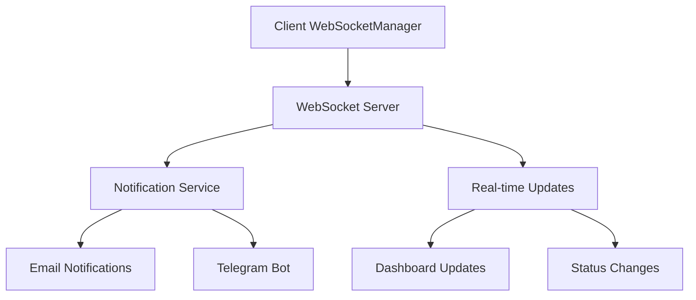
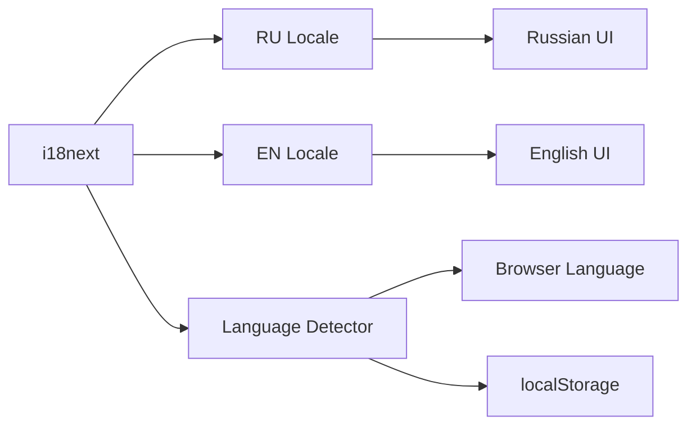
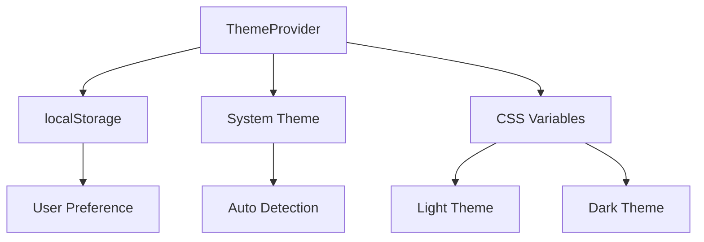

# 🗺️ AdLinkPro Platform Integration Map

## 📋 Overview
This document provides a comprehensive map of all integrations within the AdLinkPro platform, showing connections between frontend pages, backend routes, hooks, contexts, shared schemas, and infrastructure services.

---

## 🏗️ Architecture Overview

### 📱 Frontend Architecture
```
client/src/
├── components/       # UI Components & Infrastructure
├── contexts/         # React Contexts (Auth, Theme, Language, etc.)
├── hooks/           # Custom React Hooks
├── pages/           # Route Components
├── lib/             # Utilities and API clients
└── locales/         # i18n Translation Files (RU/EN)
```

### 🖥️ Backend Architecture
```
server/
├── routes/          # API Route Handlers
├── middleware/      # Auth, Security, Rate Limiting
├── services/        # Business Logic Services
├── queue/           # Background Job Processing
└── config/          # Configuration Management
```

---

## 🔄 Core Integration Matrix

### 🔐 Authentication & Authorization
| Frontend Page | Backend Route | Context | Hook | Schema | Description |
|---------------|---------------|---------|------|---------|-------------|
| `/login` | `POST /api/auth/login` | `auth-context` | `useAuth` | `insertUserSchema` | User authentication |
| `/register` | `POST /api/auth/register` | `auth-context` | `useAuth` | `insertUserSchema` | User registration |
| `ProtectedRoute` | JWT middleware | `auth-context` | `useAuth` | JWT validation | Route protection |
| All dashboard pages | `authenticateToken` | `auth-context` | `useAuth` | User roles | Role-based access |

### 🎨 Theme & Internationalization
| Component | Context | Hook | Service | Description |
|-----------|---------|------|---------|-------------|
| All UI components | `theme-context` | `useTheme` | localStorage | Light/Dark theme switching |
| All text content | `language-context` | `useTranslation` | i18next | RU/EN translation |
| Theme toggle | `theme-context` | `useTheme` | CSS variables | System theme detection |

### 🌐 WebSocket & Real-time Updates
| Frontend Component | Backend Service | Event Types | Description |
|-------------------|-----------------|-------------|-------------|
| `WebSocketManager` | WebSocket server | `notification`, `update` | Real-time notifications |
| Notification system | `notification.ts` | `offer_update`, `payout` | System notifications |
| Dashboard updates | WebSocket handlers | `stats_update` | Live dashboard data |

---

## 📄 Page-to-Backend Route Mapping

### 👑 Super Admin Pages
| Frontend Page | Backend Routes | Key Features |
|---------------|----------------|--------------|
| `/dashboard/super-admin` | `GET /api/admin/stats` | Dashboard analytics |
| `/dashboard/super-admin/users` | `GET/POST/PUT/DELETE /api/admin/users` | User management |
| `/dashboard/super-admin/offers` | `GET/POST/PUT/DELETE /api/admin/offers` | Offer management |
| `/dashboard/super-admin/analytics` | `GET /api/admin/analytics` | System analytics |
| `/dashboard/super-admin/finances` | `GET /api/admin/finances` | Financial overview |
| `/dashboard/super-admin/postbacks` | `GET /api/admin/postbacks` | Postback management |

### 🎯 Advertiser Pages
| Frontend Page | Backend Routes | Key Features |
|---------------|----------------|--------------|
| `/dashboard/advertiser` | `GET /api/advertiser/stats` | Advertiser dashboard |
| `/dashboard/advertiser/offers` | `GET/POST/PUT /api/advertiser/offers` | Offer creation/management |
| `/dashboard/advertiser/partners` | `GET /api/advertiser/partners` | Partner management |
| `/dashboard/advertiser/reports` | `GET /api/advertiser/reports` | Reporting system |
| `/dashboard/advertiser/postbacks` | `GET/POST /api/advertiser/postbacks` | Postback configuration |
| `/dashboard/advertiser/analytics` | `GET /api/advertiser/analytics` | Advanced analytics |
| `/dashboard/advertiser/anti-fraud` | `GET /api/advertiser/antifraud` | Fraud protection |

### 🤝 Partner/Affiliate Pages
| Frontend Page | Backend Routes | Key Features |
|---------------|----------------|--------------|
| `/dashboard/partner` | `GET /api/partner/stats` | Partner dashboard |
| `/dashboard/partner/offers` | `GET /api/partner/offers` | Available offers |
| `/dashboard/partner/access-requests` | `GET/POST /api/partner/access-requests` | Offer access requests |
| `/dashboard/partner/statistics` | `GET /api/partner/statistics` | Performance analytics |
| `/dashboard/partner/finances` | `GET /api/partner/finances` | Earnings & payouts |
| `/dashboard/partner/postbacks` | `GET/POST /api/partner/postbacks` | Postback profiles |

---

## 🧩 Component Integration Matrix

### 🎛️ Context Providers Integration
| Context | Provider Location | Consumer Components | Purpose |
|---------|------------------|-------------------|----------|
| `AuthContext` | `App.tsx` | All protected pages, `ProtectedRoute` | User authentication state |
| `ThemeContext` | `main.tsx` | All UI components | Theme management |
| `LanguageContext` | `main.tsx` | All pages with text | Internationalization |
| `SidebarContext` | Layout components | Navigation components | Sidebar state |

### 🪝 Custom Hooks Usage
| Hook | Used In | Backend Integration | Purpose |
|------|--------|-------------------|----------|
| `useAuth` | All authenticated pages | `/api/auth/*` | Authentication management |
| `useWebSocket` | `WebSocketManager` | WebSocket server | Real-time communication |
| `useDebounce` | Search components | Various API endpoints | Input optimization |
| `useSendEvent` | Tracking components | `/api/track/event` | Event tracking |
| `useVirtualization` | Large data tables | N/A | Performance optimization |

---

## 🔗 Infrastructure Services Integration

### 📡 WebSocket Integration


### 🌍 Translation Service Integration


### 🎨 Theme Service Integration


---

## 🔧 API Endpoint Categories

### 🔐 Authentication Endpoints
- `POST /api/auth/login` - User login
- `POST /api/auth/register` - User registration
- `GET /api/auth/me` - Current user info
- `POST /api/auth/logout` - User logout
- `POST /api/auth/refresh` - Token refresh

### 📊 Analytics Endpoints
- `GET /api/analytics/dashboard` - Dashboard stats
- `GET /api/analytics/performance` - Performance metrics
- `GET /api/analytics/geography` - Geographic data
- `GET /api/analytics/devices` - Device statistics
- `GET /api/analytics/conversions` - Conversion tracking

### 💰 Financial Endpoints
- `GET /api/finances/balance` - User balance
- `GET /api/finances/transactions` - Transaction history
- `POST /api/finances/payout` - Payout request
- `GET /api/finances/reports` - Financial reports

### 🎯 Offer Management Endpoints
- `GET /api/offers` - List offers
- `POST /api/offers` - Create offer
- `PUT /api/offers/:id` - Update offer
- `DELETE /api/offers/:id` - Delete offer
- `POST /api/offers/:id/access` - Request access

### 📬 Postback Integration Endpoints
- `GET /api/postbacks/profiles` - List profiles
- `POST /api/postbacks/profiles` - Create profile
- `PUT /api/postbacks/profiles/:id` - Update profile
- `POST /api/postbacks/test` - Test postback
- `GET /api/postbacks/logs` - Delivery logs

---

## 🛠️ Shared Schemas Integration

### 📋 Schema Files & Usage
| Schema File | Used By | Purpose |
|-------------|---------|----------|
| `schema.ts` | All user/offer operations | Core data structures |
| `postback-schema.ts` | Postback system | Tracking & conversions |
| `tracking-schema.ts` | Analytics system | Event tracking |
| `creatives-schema.ts` | Creative management | Asset management |

---

## 🔍 Infrastructure Monitoring Points

### 🚨 Critical Integration Points
1. **Authentication Flow**: Login → JWT → Role checking → Page access
2. **Data Flow**: Frontend request → Backend validation → Database → Response
3. **Real-time Flow**: Event → WebSocket → Frontend notification → UI update
4. **Theme Flow**: Theme change → Context update → CSS variables → UI rerender
5. **i18n Flow**: Language change → i18next → Translation load → UI update

### 📊 Performance Monitoring
- API response times for all endpoints
- WebSocket connection stability
- Theme switching performance
- Translation loading times
- Database query performance

---

## 🧪 Integration Testing Matrix

### ✅ Authentication Tests
- [ ] Login flow with all user roles
- [ ] JWT token validation
- [ ] Route protection verification
- [ ] Session management

### ✅ Infrastructure Tests
- [ ] WebSocket connection and messaging
- [ ] Theme switching functionality
- [ ] Translation loading and switching
- [ ] Real-time notification delivery

### ✅ API Integration Tests
- [ ] All CRUD operations for each entity
- [ ] Error handling and validation
- [ ] Rate limiting functionality
- [ ] Data consistency checks

---

## 🔄 Regular Integration Audit Checklist

### 📋 Daily Checks
- [ ] WebSocket connectivity status
- [ ] Authentication service health
- [ ] Database connection stability
- [ ] Translation service availability

### 📋 Weekly Checks
- [ ] API endpoint response times
- [ ] Frontend-backend data consistency
- [ ] Theme system functionality
- [ ] Notification delivery rates

### 📋 Monthly Checks
- [ ] Full integration test suite execution
- [ ] Performance benchmarking
- [ ] Security vulnerability scanning
- [ ] Documentation updates

---

## 🚀 Future Integration Enhancements

### 📅 Planned Integrations
1. **Advanced WebSocket Features**
   - Presence indicators
   - Real-time collaboration
   - Live chat support

2. **Enhanced Analytics Integration**
   - Real-time dashboard updates
   - Advanced filtering capabilities
   - Custom report generation

3. **Mobile App Integration**
   - React Native app
   - Push notifications
   - Offline synchronization

4. **Third-party Integrations**
   - Additional tracker support
   - Payment gateway integration
   - CRM system connectivity

---

*Last Updated: [Date will be automatically updated during implementation]*
*Version: 1.0*